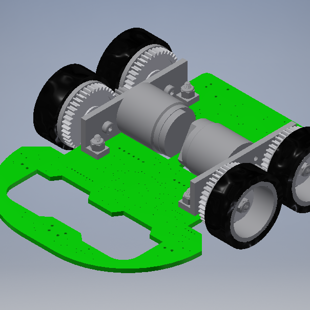
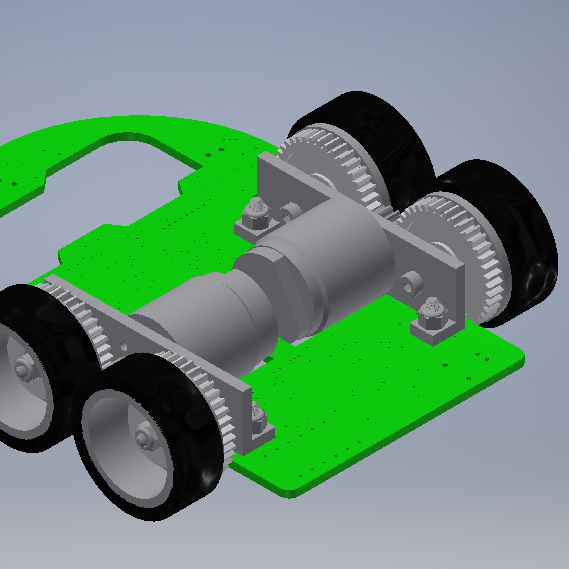
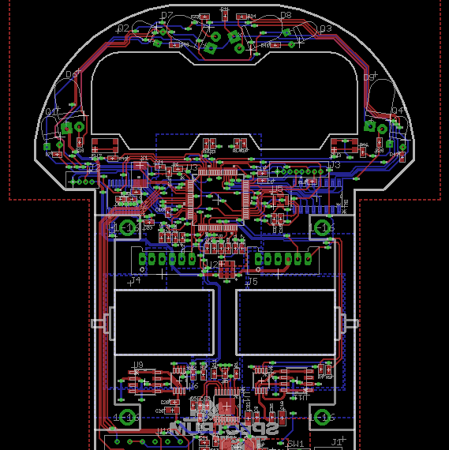
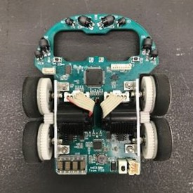

  
  
  
  

Micromouse is a competition where small autonomous robots (mice) attempt to solve a 16 x 16 maze. The maze is a 16 by 16 grid of cells which are divided by walls and posts. The mice must navigate through the maze and find the center. Using feedback from sensors and different searching algorithms, the mouse will need to remember its past movements and its position within the maze. After mapping its way to the center, the mouse will attempt to explore any additional paths back to the starting cell. As it traverses back toward the start, the mouse will determine the fastest path to the center. Once it reaches the starting cell, the mouse will move along the optimal path to the center. Time trials are held for all micromouse teams and the team with the fastest time to the center wins.

For this project, I was the team lead and oversaw the entire design and software development of my team's mouse. Specifically, I used AutoDesk Inventor (a computer aided design program) to design custom motor brackets and wheels for the mouse. Additionally, I acquired all the necessary parts and modeled the entire mouse before building it to ensure proper clearances. After the mechanical design phase was complete, I designed the schematic and the layout of the mouse PCB (printed circuit board). I used soldering irons and a reflow station to populate and test all the surface mounted electrical components on the PCB.

With all the mechanical and hardware aspects of the project complete, I joined my teammates in developing the software. I developed code for driving DC motors using a PID closed loop control system using feedback from encoders and IR emitter/detector pairs. We implemented a velocity PID controller to ensure that the motor was turning at the desired speed and overlaid that controller with another positional PID controller to correct our mouse's position within the maze cells. On the day of the competition, we placed first and finished in less than half the time of the runner-up team.

You can learn more at the [UH Micromouse Website](http://www-ee.eng.hawaii.edu/~mmouse/about.html) and see the results of the [competition](http://www-ee.eng.hawaii.edu/~tep/Projects/F17/minicomp2.html).
