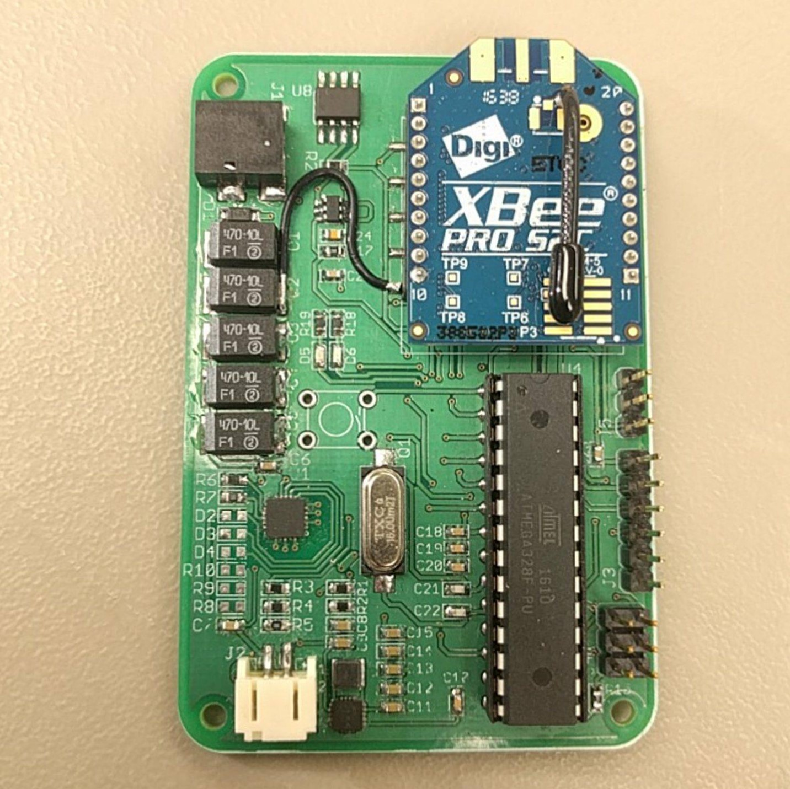

The objective for this project was to design a self-sustainable sensor node, otherwise known as a weatherbox, which collects weather and solar irradiance data which then gets sent over to a database for analysis and storage.  The sensor node has a plethora of sensors to collect barometric, humidity, solar irradiance, and temperature data and is programmed to poll the sensors at a user-specified period. The data is then consolidated into the appropriate packet format and is sent over to the lab database via an XBee wireless transceiver.

By collecting and transmitting data continuously, other teams in SCEL can use this data to create trends and predict the weather a few hours into the future. Ideally, SCEL could advise campus authorities to turn off air conditioning units or any other electrical appliance accordingly. This would be very useful in cutting down on UH Manoa’s electricity usage, as the university spent $34.3 million on air conditioning alone in 2014.

In this project I led a team of three people to develop the weatherbox. I used EAGLE to design the schematic and the board layout and also populated the circuit board with electronic components. I also worked with my teammates to develop the firmware for communicating with the various sensors using different communication protocols (UART, SPI, I2C).

You can learn more about the Smart Campus Energy Lab at the website.

Source: <a href="https://github.com/theVacay/vacay"><i class="large github icon"></i>theVacay/vacay</a>
