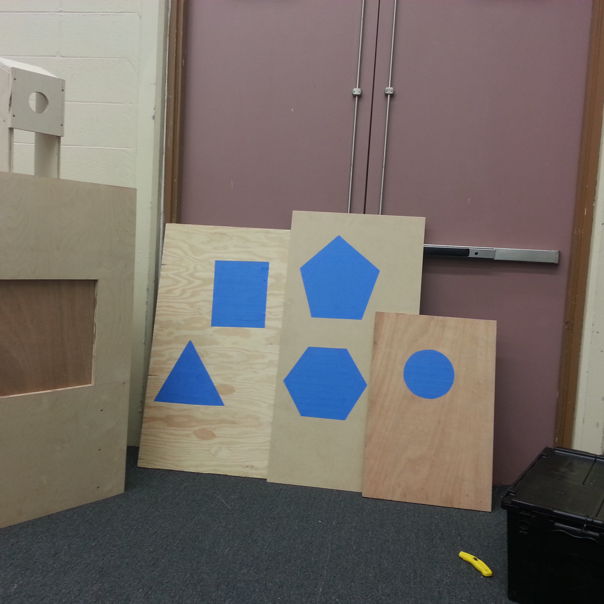
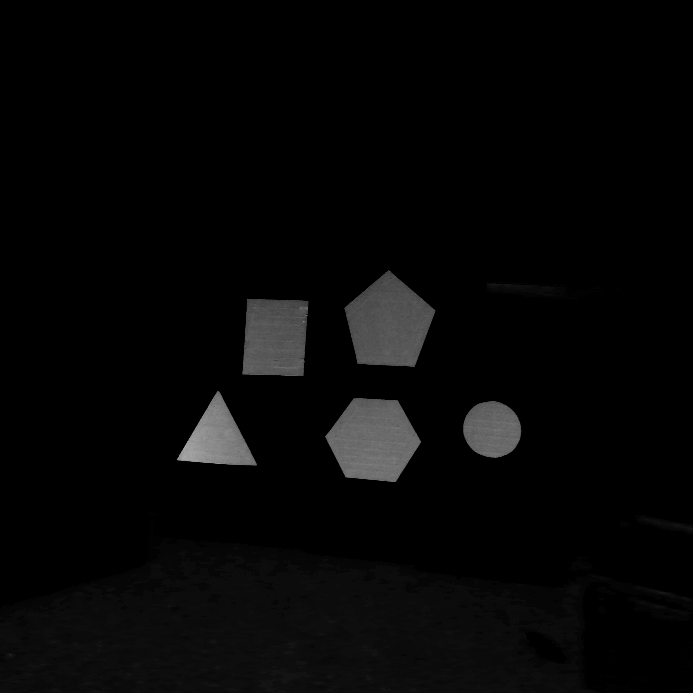
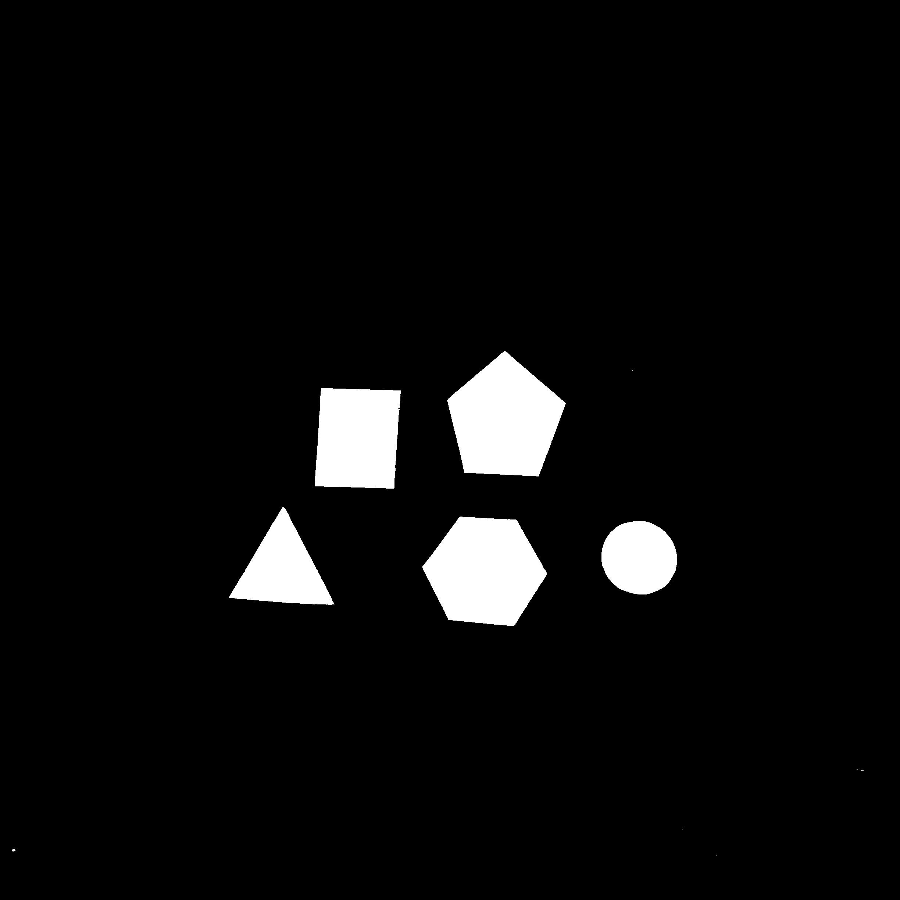

  
  
  
  

Humans use their eyes and brains to gather and process information about the world around them. Computer vision is the science which strives to provide similar capabilities to a machine or computer. It entails the usage of complex algorithms and filtering methods to extract and analyze useful information from a single image or a sequence of images. Such useful information include characteristics of the image/video such as classification, feature extraction, and pattern recognition. There are many uses for this technology which include, but are not limited to, agriculture, augmented reality, autonomous vehicles, and biometrics.

For my high school senior project, I focused on detecting and identifying various shapes from different images. I developed my object detecton program to use various filters, thresholding, and contour counting to identify simple polygons. The input images were taken in different backgrounds and lighting scenarios to truly test the capabilities of my program. From the input image, the object detection program would split the image into RGB values and intensify the blue objects. From there, a thresholding operation was performed to completely filter out any objects with lesser blue values than the given threshold. This resulted in a binary image (black and white). After that, the binary image was scanned through for contours (vertices) and shapes were approximated from the curves and lines. The contours were then used to determine the appropriate shape based on their properties.

More information about image processing and the different functions for filtering and thresholding can be found at the [OpenCV documentation page](https://docs.opencv.org/2.4/modules/refman.html).
